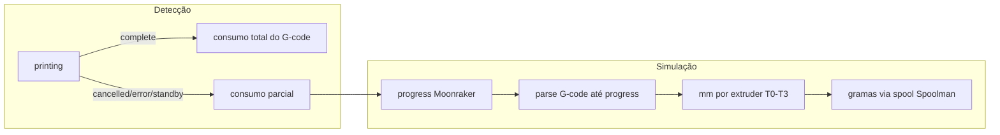

# Consumo parcial por simulação de G-code (4 materiais)

## Resposta à pergunta sobre camada

**Não**, pelos comentários do G-code do Orca/Snapmaker você **não** obtém consumo por material por camada. O arquivo traz apenas totais planejados, por exemplo:

```gcode
; filament used [g] = 0, 9.15, 0, 0
; filament used [mm] = 0, 3120, 0, 0
; total layers count = 137
```

Usar `camada_atual / total_camadas × plano_por_material` **não funciona** em multi-material: cada extruder entra em momentos diferentes (suporte, cor A, cor B, wipe tower). Cancelar na camada 30 pode ter usado só o extruder 1, mas ainda não o 3.

A camada só serve como indicador grosseiro de progresso. Para 4 materiais com precisão, a abordagem correta (sua escolha) é **simular o G-code** até o ponto do cancelamento.



---

## O que existe hoje

- Detecção só em `complete` / `standby` (transição), ignorando `cancelled` e `error` — ver [`bridge.go`](c:\Developer\filabridge\bridge.go) linhas 1093–1094.
- Consumo sempre pelo **total planejado** no G-code — [`handlePrintFinished`](c:\Developer\filabridge\bridge.go).
- Klipper expõe `print_stats.filament_used` **agregado** (mm), sem breakdown por extruder — [`moonraker.go`](c:\Developer\filabridge\moonraker.go).
- Parser atual ([`gcode.go`](c:\Developer\filabridge\gcode.go)) lê só metadados de cabeçalho/rodapé, não percorre comandos de extrusão.

---

## Abordagem proposta

### 1. Detectar fim parcial vs completo

Em [`constants.go`](c:\Developer\filabridge\constants.go) adicionar `MoonrakerStateCancelled = "cancelled"`.

Em [`monitorPrinter`](c:\Developer\filabridge\bridge.go):

| Estado | Modo |
|--------|------|
| `complete` | **Total** — comportamento atual (metadados G-code) |
| `cancelled`, `error` | **Parcial** — simulação |
| `standby` após `wasPrinting` | **Parcial** — cobre cancel com `SDCARD_RESET_FILE` |

Manter deduplicação via `processed_jobs` para não contar duas vezes.

### 2. Ponto de parada na simulação

Usar `virtual_sdcard.progress` (0.0–1.0), já disponível em [`MoonrakerPrinterStatus`](c:\Developer\filabridge\moonraker.go).

- Processar linhas do G-code até `stopAt := progress × totalLinhas` (ignorar comentários vazios).
- Se `progress <= 0` ou `print_duration == 0`: consumo zero (nada a descontar).
- `print_stats.filament_used` como **sanity check** nos logs (comparar soma simulada vs valor Moonraker), não como fonte primária de split.

Opcional futuro: usar `file_position` do Moonraker se disponível (mais preciso que contagem de linhas).

### 3. Novo parser de extrusão parcial

Criar [`gcode_extrusion.go`](c:\Developer\filabridge\gcode_extrusion.go) com:

```go
func ParsePartialExtrusionUsage(gcodeContent []byte, progress float64) map[int]float64
// retorna mm extrudidos por extruder index (0-based)
```

Lógica da simulação (linha a linha até o ponto de parada):

- Rastrear `currentTool` (comandos `T0`–`T3`, `T{n}`).
- Rastrear modo extrusor: `M82`/`M83` (absoluto/relativo) — padrão Klipper absoluto.
- Em `G0`/`G1`/`G2`/`G3` com `E`, acumular delta de extrusão no extruder ativo.
- Ignorar linhas de comentário, macros de temperatura, etc.
- Zerar extruders sem extrusão (não aparecem no mapa).

Testes em [`gcode_extrusion_test.go`](c:\Developer\filabridge\gcode_extrusion_test.go) com G-code sintético multi-tool (T0 nas primeiras linhas, T1 depois, parar em 50% progress).

### 4. Conversão mm → gramas por toolhead

Estender [`filamentUsageFromPrintStats`](c:\Developer\filabridge\bridge.go) para aceitar `(printerName, toolheadID, mm)` e buscar diâmetro/densidade do **spool mapeado naquele toolhead** (não só toolhead 0).

### 5. Integrar em `handlePrintFinished`

Alterar assinatura para receber modo (`PrintFinishFull` / `PrintFinishPartial`):

```go
func (b *FilamentBridge) handlePrintFinished(..., mode PrintFinishMode) error
```

- **Full**: fluxo atual (`ParseFilamentUsageFromFile` → gramas planejadas).
- **Partial**:
  1. Baixar G-code (já existe).
  2. `ParsePartialExtrusionUsage(content, printerStatus.Progress)`.
  3. Converter cada extruder com mm > 0 para gramas via spool mapeado.
  4. Se simulação retornar vazio mas `filament_used > 0`: fallback conservador — atribuir tudo ao único extruder ativo (`extruders_used` Snapmaker) ou ao toolhead 0 mapeado.
  5. Chamar `processFilamentUsage` com o mapa parcial.

Log claro: `Partial print (cancelled): extruder usage simulated at 42% progress: {1: 3.2g}`.

### 6. Documentação

Atualizar seção de troubleshooting em [`.github/README.md`](c:\Developer\filabridge\.github\README.md): cancelamentos/falhas agora registram consumo parcial; `complete` continua com total planejado.

---

## Limitações conhecidas (documentar, não bloquear v1)

- Simulação por **contagem de linhas × progress** é aproximada (macros longas podem skew leve).
- G-code com extrusão em formato não padrão (dual E axes) pode precisar ajuste futuro.
- `SET_PRINT_STATS_INFO` / camada **não** entra no cálculo — só progress + parse de extrusão.

---

## Arquivos principais

| Arquivo | Mudança |
|---------|---------|
| [`bridge.go`](c:\Developer\filabridge\bridge.go) | Detecção cancelled/error/standby parcial; `handlePrintFinished` com modo |
| [`gcode_extrusion.go`](c:\Developer\filabridge\gcode_extrusion.go) | **Novo** — simulação de extrusão por extruder |
| [`gcode_extrusion_test.go`](c:\Developer\filabridge\gcode_extrusion_test.go) | **Novo** — testes multi-tool + progress |
| [`constants.go`](c:\Developer\filabridge\constants.go) | Estado `cancelled` |
| [`moonraker.go`](c:\Developer\filabridge\moonraker.go) | Sem mudança obrigatória (progress já existe) |
| [`bridge_test.go`](c:\Developer\filabridge\bridge_test.go) | Testes de detecção de fim parcial |
