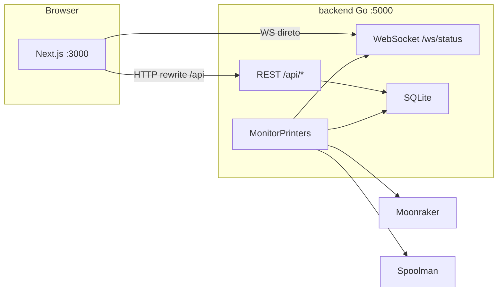

# Plano: FilaBridge com Next.js na interface

## Arquitetura alvo



**Decisões fixas (suas escolhas):**
- UI: **Next.js 16 App Router** + **shadcn/ui** + **Tailwind**
- Idioma: **inglês** (como hoje)
- Go continua com polling + API no **mesmo processo** (equivalente ao modo padrão atual, sem HTML)

---

## Estrutura de pastas final

```
filabridge/
├── backend/
│   ├── main.go              # bridge + API (sem HTML)
│   ├── bridge.go
│   ├── api.go               # ex-web.go, só Gin API + WS
│   ├── moonraker.go
│   ├── spoolman.go
│   ├── gcode.go
│   ├── nfc.go
│   ├── config.go
│   ├── constants.go
│   ├── *_test.go
│   ├── go.mod / go.sum
│   └── Dockerfile
├── web/
│   ├── app/
│   │   ├── layout.tsx
│   │   ├── page.tsx                    # Dashboard (Status tab)
│   │   ├── nfc/
│   │   │   └── assign/page.tsx         # fluxo mobile de scan
│   │   └── (dashboard)/
│   │       ├── settings/page.tsx       # ou tabs na page principal
│   │       └── nfc/page.tsx
│   ├── components/
│   │   ├── layout/                     # header, tabs, ws indicator
│   │   ├── dashboard/                  # printer cards, toolhead mapping
│   │   ├── settings/                   # config, printers, advanced
│   │   └── nfc/                        # QR tags, location manager
│   ├── lib/
│   │   ├── api.ts                      # cliente REST tipado
│   │   ├── websocket.ts                # hook useStatusWebSocket
│   │   └── types.ts                    # espelha structs Go
│   ├── next.config.ts
│   ├── package.json
│   └── Dockerfile
├── data/                               # volume SQLite (inalterado)
├── docker-compose.yml                  # 2 serviços
├── package.json                        # scripts raiz (dev paralelo)
└── README.md
```

Arquivos removidos ao final: [`templates/`](templates/), [`static/`](static/), embed de HTML em [`web.go`](web.go).

---

## Fase 1 — Reorganizar backend (sem mudar comportamento ainda)

**Objetivo:** mover Go para `backend/` mantendo tudo funcionando.

1. Mover todos os `*.go`, `go.mod`, `go.sum`, `*_test.go` para `backend/`.
2. Atualizar [`Dockerfile`](Dockerfile) → `backend/Dockerfile` (paths de COPY).
3. Atualizar [`docker-compose.yml`](docker-compose.yml) (`build: ./backend`).
4. Atualizar [`.github/workflows/docker-build.yml`](.github/workflows/docker-build.yml) e [`release.yml`](.github/workflows/release.yml).

**Modos do `main.go` após refactor:**

| Flag | Comportamento |
|------|---------------|
| **(padrão)** | bridge + API + WebSocket (sem HTML) |
| `--legacy-ui` | bridge + API + HTML antigo (temporário, para rollback) |
| `--bridge-only` | só polling (inalterado) |

O modo padrão deixa de servir `GET /` e `/static/*`. O HTML só existe com `--legacy-ui` até a UI Next.js estar completa.

---

## Fase 2 — Ajustes de API no Go

A UI Next.js não pode depender de SSR do Gin. Mudanças mínimas em [`web.go`](web.go) → `api.go`:

### 2.1 Novo endpoint de bootstrap

`GET /api/bootstrap` — consolida o que hoje só existe no `dashboardHandler`:

```go
// Retorno proposto
{
  "status": { ... },           // igual GetStatus()
  "spools": [ ... ],
  "printers": { ... },         // config das impressoras
  "print_errors": [ ... ],
  "is_first_run": bool,
  "spoolman_connected": bool,
  "spoolman_error": string,
  "spoolman_base_url": string
}
```

Baseado na lógica atual em:

```356:398:c:\Developer\filabridge\web.go
func (ws *WebServer) dashboardHandler(c *gin.Context) {
    status, err := ws.bridge.GetStatus()
    // ... spools, isFirstRun, printErrors ...
    c.HTML(http.StatusOK, "index.html", gin.H{ ... })
}
```

### 2.2 NFC: HTML → JSON

Hoje [`nfcAssignHandler`](web.go) retorna `nfc_progress.html` / `nfc_success.html` / `nfc_error.html`.

- Novo: `POST /api/nfc/assign` com body `{ spool?: number, location?: string }` e resposta JSON:
  ```json
  { "complete": false, "message": "...", "session_id": "...", "has_spool": true, "has_location": false }
  ```
  ou quando completo:
  ```json
  { "complete": true, "spool_id": 1, "printer_name": "...", "toolhead_id": 0, "location_name": "..." }
  ```
- Manter `GET /api/nfc/assign?...` com **redirect 302** para `/nfc/assign?...` no Next.js (compatibilidade com tags NFC antigas).

### 2.3 URLs de QR code

Em [`nfcUrlsHandler`](web.go), hoje gera `http://{host}/api/nfc/assign?spool=N`.

- Adicionar config `web_base_url` em [`constants.go`](constants.go) / SQLite (ex.: `http://localhost:3000`).
- QR codes passam a apontar para `{web_base_url}/nfc/assign?spool=N`.
- Campo editável na aba Settings → Basic Configuration.

### 2.4 CORS (dev)

Middleware Gin permitindo `http://localhost:3000` em desenvolvimento. Em produção via Docker, o proxy do Next.js evita CORS para HTTP; WebSocket usa conexão direta ao backend.

---

## Fase 3 — Scaffold Next.js 16 + shadcn/ui

Dentro de `web/`:

```bash
npx create-next-app@latest . --typescript --tailwind --app --src-dir=false
npx shadcn@latest init
```

**Componentes shadcn a instalar na migração:**
`tabs`, `card`, `button`, `badge`, `alert`, `dialog`, `input`, `label`, `select`, `combobox` (para spool picker), `separator`, `sonner` (toasts).

### Config de proxy — [`web/next.config.ts`](web/next.config.ts)

```typescript
async rewrites() {
  return [
    { source: "/api/:path*", destination: `${process.env.BACKEND_URL}/api/:path*` },
  ];
}
```

**WebSocket:** não confiar em rewrite do Next.js. Usar `NEXT_PUBLIC_WS_URL=ws://localhost:5000` e conectar direto em `/ws/status` (já permitido — `CheckOrigin: true` em [`web.go`](web.go) linha 261).

### Tipos TypeScript — [`web/lib/types.ts`](web/lib/types.ts)

Espelhar structs de [`bridge.go`](bridge.go) e [`web.go`](web.go):
`PrinterStatus`, `ToolheadMapping`, `SpoolmanSpool`, `PrintError`, `WebSocketMessage`.

### Hook WebSocket — [`web/lib/websocket.ts`](web/lib/websocket.ts)

Portar lógica de [`static/js/websocket.js`](static/js/websocket.js):
- reconexão com backoff
- indicador Live/Offline no header
- estado React compartilhado (Context ou Zustand leve)

---

## Fase 4 — Migração da UI (por aba)

Mapeamento 1:1 do que existe hoje:

| UI atual | Arquivo origem | Destino Next.js |
|----------|----------------|-----------------|
| Status / Dashboard | [`templates/status.html`](templates/status.html) + [`dropdowns.js`](static/js/dropdowns.js) | `app/page.tsx` + `components/dashboard/` |
| Settings (4 sub-abas) | [`templates/settings.html`](templates/settings.html) + [`main.js`](static/js/main.js) | tab Settings ou `settings/page.tsx` |
| Printers CRUD | [`printers.js`](static/js/printers.js) | `components/settings/printers-manager.tsx` |
| NFC tags | [`templates/nfc.html`](templates/nfc.html) + [`nfc.js`](static/js/nfc.js) | tab NFC + `components/nfc/` |
| NFC scan flow | [`nfc_*.html`](templates/) | `app/nfc/assign/page.tsx` |
| Modals | [`templates/modals.html`](templates/modals.html) | shadcn `Dialog` |

### Prioridade de implementação

1. **Layout + tabs** — header, navegação Status / NFC / Settings
2. **Dashboard** — printer cards, status badges, toolhead spool combobox, print errors
3. **WebSocket live updates** — substituir manipulação DOM de `websocket.js` por state React
4. **Settings → Basic + Printers** — forms com `react-hook-form` + shadcn
5. **Settings → Advanced** — timeouts, auto-assign previous spool
6. **NFC Management** — listas de QR (usar `qr_code_base64` da API existente `/api/nfc/urls`)
7. **NFC Assign page** — página mobile-first para scan de tags
8. **First-run welcome banner** — dados de `/api/bootstrap`

### Melhorias visuais (além da paridade)

- Layout responsivo mobile (NFC no celular é caso de uso real)
- Dark mode via shadcn (tema consistente, substitui CSS custom espalhado em 7 arquivos)
- Combobox com busca para spools (substitui dropdown custom de [`dropdowns.js`](static/js/dropdowns.js) — ~450 linhas)
- Toasts em vez de `alert()` (hoje usado em [`main.js`](static/js/main.js), [`printers.js`](static/js/printers.js))

---

## Fase 5 — Docker e scripts de desenvolvimento

### `docker-compose.yml` (2 serviços)

```yaml
services:
  backend:
    build: ./backend
    volumes: ["./data:/app/data"]
    environment:
      FILABRIDGE_DB_PATH: /app/data
    ports: ["5000:5000"]   # opcional expor

  web:
    build: ./web
    ports: ["3000:3000"]
    environment:
      BACKEND_URL: http://backend:5000
      NEXT_PUBLIC_WS_URL: ws://localhost:5000   # browser acessa host
    depends_on: [backend]
```

### Scripts raiz — `package.json`

```json
{
  "scripts": {
    "dev": "concurrently \"cd backend && go run .\" \"cd web && npm run dev\"",
    "dev:backend": "cd backend && go run .",
    "dev:web": "cd web && npm run dev",
    "build": "cd web && npm run build",
    "docker:up": "docker compose up -d --build"
  }
}
```

### Fluxo de dev local

```bash
# Terminal único
npm run dev
# UI:  http://localhost:3000
# API: http://localhost:5000/api/status
```

---

## Fase 6 — Limpeza e documentação

1. Remover `--legacy-ui`, `templates/`, `static/`, embed FS do Go.
2. Remover dependência `go-qrcode` do backend se QR for gerado só no Next.js (opcional — pode manter geração no Go via `/api/nfc/urls`).
3. Atualizar [`README.md`](.github/README.md) com nova arquitetura, portas e variáveis de ambiente.
4. Atualizar CI para buildar imagem `web` além de `backend`.

---

## Riscos e mitigações

| Risco | Mitigação |
|-------|-----------|
| Tags NFC antigas apontam para `/api/nfc/assign` | Redirect 302 no Go + período de transição |
| WebSocket não funciona via proxy Next | Conexão direta com `NEXT_PUBLIC_WS_URL` |
| Perda de tracking ao rodar só `--web-only` | Documentar: backend padrão sempre inclui polling |
| Migração grande de uma vez | Flag `--legacy-ui` temporária; remover só na Fase 6 |

---

## Critérios de pronto (Definition of Done)

- [ ] `npm run dev` sobe backend + Next.js; dashboard funciona com live updates
- [ ] Todas as rotas `/api/*` consumidas pelo Next.js (paridade com JS atual)
- [ ] Fluxo NFC completo (gerar QR + scan + assign)
- [ ] Settings: Spoolman URL, impressoras, timeouts, auto-assign
- [ ] `docker compose up` sobe stack completa na porta 3000
- [ ] Testes Go existentes passam em `backend/`
- [ ] `templates/` e `static/` removidos
